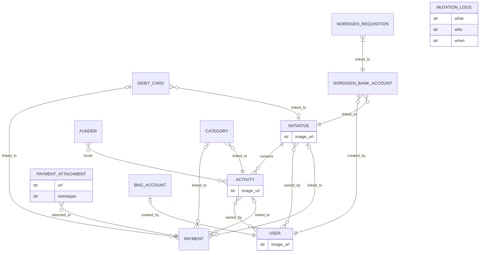

### ER-Diagram

```mermaid
erDiagram
    INITIATIVE ||--o{ ACTIVITY : contains
    INITIATIVE }o--o{ USER : owned_by
    %% We import payments from BNG without necessarily assigning them to an initiative.
    INITIATIVE |o--o{ PAYMENT : linked_to
    ACTIVITY }o--o{ USER : owned_by
    %% We import payments from BNG without necessarily assigning them to an initiative.
    ACTIVITY |o--o{ PAYMENT : linked_to
    %% It's not required to set a funder for an activity yet.
    FUNDER }o--o{ ACTIVITY : funds
    PAYMENT_ATTACHMENT }o--|| PAYMENT : attached_to
    BNG_ACCOUNT |o--|| USER : created_by
    DEBIT_CARD |o--o{ PAYMENT : linked_to
    DEBIT_CARD }o--o| INITIATIVE : linked_to
    CATEGORY |o--o{ PAYMENT : linked_to
    %% Should categories be linked to activities? Why?
    %% Related to this: why do we have initiatives -> activities again? What's the reasoning?
    CATEGORY }o--|| ACTIVITY : linked_to
    NORDIGEN_BANK_ACCOUNT }o--|| USER : created_by
    NORDIGEN_BANK_ACCOUNT }o--|| INITIATIVE : linked_to
    NORDIGEN_REQUISITION }|--|| NORDIGEN_BANK_ACCOUNT : linked_to

    INITIATIVE {
        str image_url
    }
    ACTIVITY {
        str image_url
    }
    USER {
        str image_url
    }
    PAYMENT_ATTACHMENT {
        str url
        str mimetype
    }

    MUTATION_LOGS {
        str what
        str who
        str when
    }
```